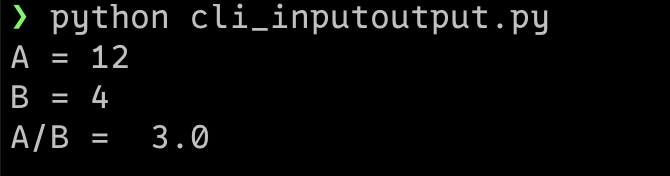
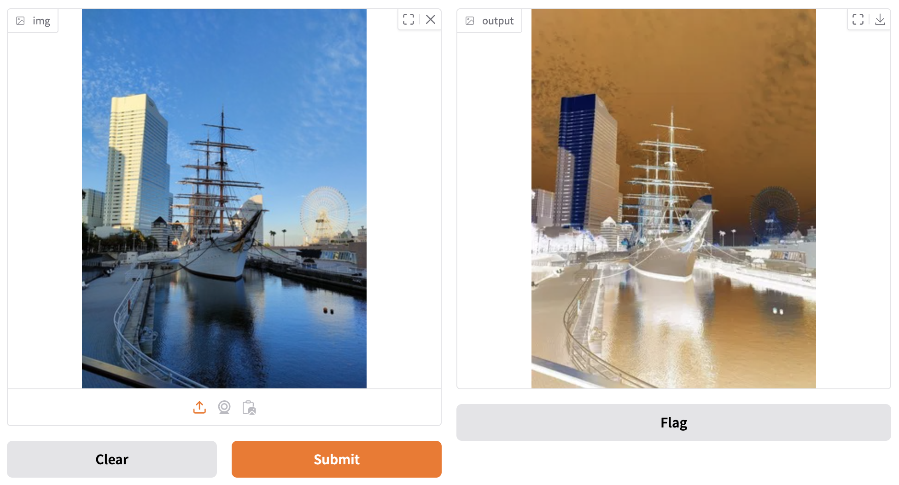

# 人気の二大Python Web UIフレームワークを使い分けよう
## Streamlit ＆ Gradio入門

NTTテクノクロス株式会社 上原潤二

### はじめに

最近、Python界隈では、美しくインタラクティブなWebアプリケーションを簡単に作成できる「Python Web UIフレームワーク」が人気を集めています。
その中でも特に注目されているのが、「Streamlit（ストリームリット）」と「Gradio（グレディオ）」の二つです。

これらは、HTMLやJavaScript、CSSといったWebフロントエンド技術を直接使用しなくてもPythonだけでWebアプリケーションを開発できます。またこのことによって学習コストを低減し、結果的にロジックの本質部分に集中することができます。この特徴により、従来よりも短時間で、見通しの良いコードを開発することができるのです。

ただし、それぞれの固有のコンセプトを持ち、方向性が異なるため、開発しようとするアプリケーションの特性を踏まえて、適したフレームワークを理解して選ぶことが重要です。本稿では、両者の特徴と基本的な使い方を比較しながら解説していきます。

### Python Web UIフレームワークとは

Python Web UIフレームワークとは何でしょうか？有名なDjangoやFlask、FastAPIなどのWebフレームワークとは何が違うのでしょうか？まずは、その違いを説明します。
一般に、Python Web UIフレームワークには以下のような特徴があります。

 - インタラクティブな処理やグラフ表示などのための豊富なUIコンポーネントが標準的に準備されており、高度なUIを少ない記述で容易に実現できる。
 - HTML、CSS、JavaScript、SPAなどのWebフロントエンド技術が隠蔽されており、基本的にPythonコードだけでWebアプリを作成できる。
 - ブラウザとサーバー間の通信処理（HTTP）も隠蔽されており、たとえばPOSTやGETなどのHTTPリクエストを意識する必要がない。
 - データベースアクセスなどのバックエンド機能は含まれず、UI開発のみに特化している。

以上により、見た目が良く、操作しやすいWebアプリケーションを比較的短期間で開発できます。一方で、画面作成上の自由度や表現力は限られ、表示速度や反応速度は、従来のチューニングされたWebアプリケーションに比べて劣ることが多いでしょう。

そのため、Python Web UIフレームワークは、不特定多数が利用するアプリではなく、インハウスでの利用、たとえばツール開発、ダッシュボード、データサイエンスや生成AIアプリなど比較的負荷が低い用途のアプリ開発に適しています。またPoC(原理実証)やMVP(顧客のニーズを満たす最小限のプロダクト)の開発や、比較的小規模の開発に向いていると言えるでしょう。

### StreamlitとGradioとFlaskの比較

表1に主な特徴の比較表を示します。また参考として、Pythonの簡易Webアプリフレームワークとして代表的なFlaskの情報を示しました。

[表1● StreamlitとGradio、およびFlaskの比較]

| 項目 | Streamlit | Gradio | Flask |
|------|----------|--------|-------|
| **開発言語** | Python | Python | Python/HTML/CSS/JS |
| **典型的な用途** | インタラクティブなダッシュボード | 機械学習モデルのデモ | 任意のWebアプリ |
| **UI構築の概念** | 画面構築とイベントハンドラの融合 | 関数を対話的なアプリに変えるラッパー | Flask単体ではUIを提供しない |
| **組み込みUIコンポーネント** | 多数の標準UIあり | 多数の標準UIあり | なし（Flask単体ではUIを提供しない） |
| **学習コスト** | 低い（PythonのみでOK） | 低い（PythonのみでOK） | 高い（フロントエンド技術が必要） |
| **カスタマイズの自由度** | 低 | 低 | 高 |
| **スケーラビリティ** | 低（小規模向け） | 低（小規模向け） | 高（規模によらない） |

StreamlitとGradioの両者にはPython Web UIフレームワークとして重なるところも大きいのですが、重要な違いをいくつか示しておきます。

#### Streamlitは実行の過程が画面配置を決める

コンソールで実行するPythonのコマンドラインプログラムとして、リスト1を考えてみてください。

[リスト1●cli_inputoutput.py。コンソールで入出力を行うPythonプログラム]

```python
# cli_inputoutput.py
a = float(input("A = "))  # ①
b = float(input("B = "))  # ②
if b != 0:
  print("A/B = ", a / b)  # ③
else:
  print("error")
```

このコードは「python3 divide_console.py」でコンソールから実行できます(図1)。

[図1●リスト1の実行例]



リスト1では、①②での入力の結果を得て、③でそれを出力するような実行の過程を記述しています。
Streamlitではこのような処理をリスト2のように記述できます。

[リスト2●st_inputoutput.py。Streamlitで入出力を行うWebアプリケーション]

```python
# st_inputoutput.py
import streamlit as st

a = st.number_input("A") # ①
b = st.number_input("B") # ②
if b != 0:
  st.write("A/B = ", a / b)
else:
  st.write("error")
```

コンソール版のものと記述の流れほぼと対応していることがわかります。
このように、
画面にUIコンポーネントを配置するための記述と、プログラムの実行処理の記述が表裏一体になっていることがStreamlitの大きな特徴です。

これを「streamlit run st_inputoutput.py」として実行し、
ブラウザでlocalhostの8085ポートを開くと図2のようにWebアプリケーションとして実行することができます。

[図2●リスト2の実行結果]


<div style="border: 1px solid #ccc; border-radius: 1rem; margin: 1rem; padding: 0rem 1rem 1rem 1rem; width: 90%; background: lightyellow;">

<font size="+3">⚠</font>

なお、コンソール版とStreamlit版では動作の大きな違いもあります。コンソール版の「input()」は、ユーザーが文字列を入力し、エンターキーを押すまで処理をブロックします。一方で、StreamlitのUIコンポーネント(ここでは「st.number_input()」)は、呼び出しても**処理をブロックしません**。

そのため、リスト2の①でaへの入力を待つことなく、②のbの入力欄も最初から表示されます。このことはStreamlitプログラムの動作を理解するうえで重要なポイントの一つです。

</div>

#### Gradioは関数を対話的なアプリに変えるラッパー

Gradioはもともと機械学習モデルのインタラクティブなデモの作成を目的として開発されていて、
機械学習モデルを共有・公開するサイトHugging Faceで活用されています。
ただし、Gradioは機械学習モデルのデモに留まらない、豊富で汎用的な機能を備えており、
本稿でも汎用的なPython Web UIフレームワークとして見たときの機能やプログラミングについて解説します。

それを前提として、Gradioを一言で説明するならば、**「関数を対話的なアプリに変えるラッパー」** です。例として、Gradioのコード例リスト3を見てみましょう。

[リスト3●gr_invert.py。画像を反転させるアプリケーション]

```python
# gr_invert.py
import gradio as gr
import numpy as np

# 色を反転させる関数
def invert_colors(img: np.ndarray) -> np.ndarray:
    return 255 - img

demo = gr.Interface(fn=invert_colors, # ラッピングしたい関数fn
                    inputs="image", # fnの引数に対するUIコンポーネントの指定(gr.Image())
                    outputs="image") # fnの返り値に対するUIコンポーネントの指定(gr.Image())
demo.launch()
```

リスト3の実行例は図3です。左側のパートに画像をアップロードして「Submit」ボタンを押下すると右側に色を反転させた画像が表示されます。

[図3●リスト3の実行結果]



これはGradioでの典型的なコード例であり、データとして画像の色を反転させる関数「invert_colors」を作成し、
それを「gr.Interface()」でラッピングするだけで、任意の画像ファイルをアップロードして反転処理をすることができる、
見栄えのよいWebアプリケーションを作成できます。

### Streamlit入門

ではここからはそれぞれのフレームワークの利用方法とプログラミング方法について、簡単に一巡りしていきます。まずはStreamlitからです。

#### Streamlitのインストール

Pythonがインストールされていることを前提として、Streamlitのインストール方法は以下の通りです。

```bash
> mkdir streamlit-sample
> cd streamlit-sample
> python3 -m venv venv
> source ./venv/bin/activate
> pip install streamlit
```

#### Streamlitで「Hello, world!」と表示するプログラム

次に、Streamlitで「Hello, world!」を表示するプログラムを作成します(リスト4)。

[リスト4●st_hello.py。Streamlitで「Hello, world!」を表示するプログラム]

```python
# st_hello.py
import streamlit as st # ①

st.write("Hello, world!")
```

リスト4を解説すると、①ではStreamlitライブラリをインポートし「st」という短縮名で利用できるようにします。
次に、②ではWebブラウザに文字列を表示するために「st.write()」コンポーネントを呼び出します。以下のコマンドを実行することでWebアプリとして起動できます。

```bash
> streamlit run st_hello.py
```

起動後にWebブラウザでlocalhostのポート番号8501を開くと、作成したWebアプリを図4-1のように実行できます。

[図4-1●リスト4の実行結果]


ここで、プログラムを実行したままバックグラウンドでPythonコードを変更・保存することで、再起動無しでプログラムを置き換える、いわゆるホットリローディングを行うことができます。たとえば「st_hello.py」の「st.write("Hello world!")」を「st.markdown("こんにちは\*\*世界!\*\*")」にエディタで書き換えて保存すると、
StreamlitのランタイムはPythonコードのファイル更新を検知して、ブラウザの画面上部に以下を表示します。

[図4-2●リスト4の再実行時の画面上部]


ここで「<u>R</u>erun」をクリックすると一回だけの再実行ができます。「<u>A</u>lways rerun」をクリックするとPytyonコードが更新されるたびに自動で再読み込みと再実行が行なわれるようになります。

[図4-3●リスト4の修正版の再実行結果]


#### StreamlitでのBMI計算機のプログラム

次の題材として、BMI(ボディ・マス指数、体重と身長の比率から計算される体格の指標)
を計算するプログラムをStreamlitで作成してみます(リスト5)。

[リスト5●st_bmi.py。Streamlitで作ったBMI計算機のプログラム]

```python
# st_bmi.py
import streamlit as st

def bmi(height, weight):  # ①
  return weight / (height / 100) ** 2  # ②

if height := st.number_input("身長(cm)"):  # ③
  if weight := st.number_input("体重(kg)"):  # ④
    if height > 0 and weight > 0:  # ⑤
      bmi_value = bmi(height, weight)  # ⑥
      st.markdown(f"BMI = {bmi_value:.2f}")  # ⑦
    else:
      st.markdown("身長と体重を入力してください")
```

リスト5を実行すると、まず身長欄のみが表示されます。そして身長を入力すると体重入力欄が表示され、体重を入力すると結果が表示される、というように逐次実行されます(図5)。

[図5●リスト5の実行結果]


リスト5のプログラムを説明します。まず、①②ではBMIを計算する関数を定義しています。これは通常のPythonの関数定義です。

③④では身長と体重の入力欄を表示し、入力された値をそれぞれheight、weightの変数に保存します。
なお、ここで使用されている「:=」は、Python 3.8で導入された「代入と同時にその値を返す演算子」です。
この演算子を使わない場合、③のif文は、

```python
height = st.number_input("身長(cm)"):
if height:
  :
```

とも書けますが、コードがやや冗長になります。

ここでのif文は、入力が空(None)であればif文本体は実行されないので、
「身長が入力されると体重の入力欄が表示され、体重の入力をすると結果が表示される」
という動作を実現しています。

このように、入力が進行するにつれその処理結果や次の入力欄が次々に下に追記されていく、
いわば「インタラクティブなワークフロー」とでも言うべき処理を簡単に書けることがStreamlitの特徴の一つです。
このような動作は、コンソールで動作するプログラムやGoogle Collabでの実行とイメージが似ています。
ちなみに、ここで仮にif文でネストさせずに、以下のようにフラットに入力欄を並べて書いていたとしたら、
身長(heght)欄と体重(weight)の入力欄は同時に表示されます。

```python
height = st.number_input("身長(cm)"):
weight = st.number_input("体重(kg)"):
```

⑤では、入力された身長と体重が0より大きいことをチェックしています。0以下である場合はエラーメッセージを表示し、そうでなければ関数bmiを呼び出してBMIの値を整形して表示します(⑥⑦)。

<div style="border: 1px solid #ccc; border-radius: 1rem; padding: 1rem; width: 90%; background: lightblue">

##### コラム: if文のネストを避ける方法

if文のネストを使うことで、処理結果を次々と表示してくような処理がStreamlitでは書きやすいことを示しました。しかし処理が何段階にも連なっていくとif文のネストが深くなってしまいます。
これを避けるには、リスト6のようにプログラムのトップレベルを関数にして、継続しないときにifの条件を反転させてreturnするように記述すると良いでしょう。

[リスト6●処理の段階が増えてもネストが深くならない記述方法]
```python
def main():
  if not (height := st.number_input("身長(cm)")):
    return
  if not (weight := st.number_input("体重(kg)")):
    return
  if height > 0 and weight > 0:
    bmi_value = bmi(height, weight)
    st.markdown(f"BMI = {bmi_value:.2f}")
  else:
    st.markdown("身長と体重を入力してください")

main()
```
</div>

#### Streamlitで二次関数を描画するプログラム

次に紹介するのは、ユーザーが入力する係数 a, b, c に基づいて、2次関数「y= ax^2 + bx + c」のグラフを描画するプログラムです。

まず、準備として、グラフ表示のためにPythonのグラフ描画ライブラリであるmatplotlibをパッケージとしてインストールしておきます。

```bash
❯ pip install matplotlib
```

プログラムコードはリスト7の通りです。

[リスト7●st_graph.py。Streamlitで作った2次関数のグラフを描画するプログラム]

```python
# st_graph.py
import streamlit as st
import numpy as np               # ①
import matplotlib.pyplot as plt  # ②

st.title("2次関数のグラフ描画")

col1, col2 = st.columns(2)       # ③
with col1:                       # ④
  a = st.number_input("係数 a", value=1.0)  # ⑤
  b = st.number_input("係数 b", value=0.0)  # ⑥
  c = st.number_input("係数 c", value=0.0)  # ⑦
with col2:                       # ⑧
  x = np.linspace(-10, 10, 400)   # ⑨
  y = a * x**2 + b * x + c        # ⑩

  fig, ax = plt.subplots()        # ⑪
  ax.plot(x, y, label=f'y = ax^2 + bx + c\na={a}, b={b}, c={c}')
  ax.axhline(0, color='black', linewidth=0.5)
  ax.axvline(0, color='black', linewidth=0.5)
  ax.grid(color='gray', linestyle='--', linewidth=0.5)
  ax.legend()

  st.pyplot(fig)                 # ⑫
```

このプログラムの実行の様子を図7に示します。左側に係数の入力欄が表示され、
右側に入力された係数に応じた2次関数のグラフが表示されます。

[図7●リスト7の実行例]


このプログラムを説明していきます。

①②では、グラフの描画に必要なNumPyとmatplotlibの必要なモジュールをインポートします。

次にプログラムのタイトルとして「2次関数のグラフ描画」を表示します。
③④⑧ではStreamlitのUIコンポーネント「st.columns(2)」をつかって画面を左右の2つのカラムに分割します。
「col1」には左側、「col2」には左側のカラムが設定されます。with句を使うとコンテキストが作成され、その内側でのUIコンポーネントの呼び出しはそのブロック内に配置されるようになります。

⑤⑥⑦では左側のカラムに係数a,b,cの入力欄を配置します。入力結果は変数a,b,cに格納されます。

⑧以降、右側のカラムにグラフ表示コンポーネントを配置していきます。

まず、⑨ではx軸の系列の値として、-10から10までの範囲で400個の等間隔な数値を生成します。
⑩では、y軸の系列の値として、ユーザーが入力した係数を用いて、2次関数「ax^2 + bx + c」の結果の系列データを計算します。

⑪以降、matplotlibを使用して、2次関数のグラフを描画し、軸やグリッドや凡例も追加したグラフを作成します。

⑫では、作成したグラフをStreamlit上に配置します。

### Gradio入門

ここからはGradioの入門編ということでGradioのインストールと実行方法、プログラミングについて簡単に解説していきます。

#### Gradioのインストール

Pythonがインストールされていることを前提として、Gradioのインストール方法は以下の通りです。

```bash
> mkdir gradio-sample
> cd gradio-sample
> python3 -m venv venv
> source ./venv/bin/activate
> pip install gradio
```

#### Gradioで 「Hello, world!」と表示するプログラム

リスト8は、Gradioを用いて「Hello, world!」を表示するプログラムです。

[リスト8●「gr_hello.py」。Gradioで「Hello, world!」を表示するプログラム]

```python
# gr_hello.py
import gradio as gr  # ①

with gr.Blocks() as demo:   # ②
  gr.Markdown("Hello, world!")   # ③

demo.launch()  # ④
```

リスト8の実行をするには以下のコマンドを実行します。デフォルトではローカルホストの特定ポート7860でWebサーバが起動し、ブラウザから「http://localhost:7860」でアクセスできるようになります。

```
❯ gradio gr_hello.py
```

実行結果は図8の通りです。

[図8●リスト8の実行例]


以下、リスト8を解説していきます。

①ではGradioライブラリをインポートし、短縮名としてgrを割りあてています。

②ではレイアウトのためのUIコンポーネントであるgr.Blocks()を作成し、その内側にコンポーネントを配置する準備をしています。with句を使うとコンテキストが作成され、その内側での「gr.Markdown()」などのコンポーネントの呼び出しはそのブロック内に配置されるようになります。作成したブロックを「as demo」でasという変数に格納しています。

④では、demoに格納されたBrocksに対して「launch()」メソッドを呼び出し、Webアプリケーションとして起動します。ホットリロードも可能です。

```
❯ gradio gr_hello.py
```

なお、Gradioコードは、gradioコマンドではなく以下のようにpythonコマンドで実行することもできますが、この場合はホットリロードが無効になります。

```
❯ python3 gr_hello.py
```


#### GradioでのBMI計算機のプログラム

GradioでBMIを計算するプログラムを作成したものがリスト9になります。

[リスト9●「gr_bmi.py」。Gradioで作ったBMI計算機のプログラム]

```python
# gr_bmi.py
import gradio as gr

def bmi(height, weight):  # ①
  return weight / (height / 100) ** 2

demo = gr.Interface(      # ②
  fn=bmi,                # ③
  inputs=[               # ④
    gr.Number(label="身長 (cm)"),  # ⑤
    gr.Number(label="体重 (kg)")   # ⑥
  ],
  outputs=gr.Number(label="BMI"), # ⑦
  live=True              # ⑧
)

demo.launch()            # ⑨
```

実行例は図9になります。左側の身長、体重欄に値を入力すると右側にリアルタイムで計算結果が表示されます。

[図9●リスト9の実行例]


リスト9のプログラムを説明していきます。

①はBMIを計算する関数bmiの定義です。Streamlit版と全く同じものです。

②では関数の高レベルの汎用UIラッパーである「gr.Interface()」を呼び出し、demoに保存します。
「gr.Interface()」にはラッピングする対象の関数fn(③)、
関数fnへの入力の型式や方法を規定するinputs(④)、
関数fnの返り値を規定するoutputs(⑦)などを引数として与えます。

⑤⑥では、fnの引数である身長と体重の数値の入力方法として、コンポーネント「gr.Number()」を指定します。
⑦では、fnの結果の表示方法として、同じくコンポーネント「gr.Number()」を指定します。

⑧でlive=Trueに設定すると、計算結果は入力が変化したときにリアルタイムで結果が表示されます。出力に時間がかかる場合などはlive=FalseとすることでSubmitボタンを押したときのみ結果を表示するようにできます。デフォルトはlive=Falseです。

⑨では、「demo.launch()」によりGradioのgr.InterfaceコンポーネントをWebアプリとして起動します。

#### Gradioで二次関数のグラフを描画するプログラム

続いて、Gradioでも二次関数を表示するプログラムを作成してみましょう(リスト10)。

[リスト10●gr_graph.py。Gradioで作った2次関数のグラフを描画するプログラム]

```python
# gr_graph.py
import gradio as gr
import matplotlib
import numpy as np
import matplotlib.pyplot as plt
from matplotlib.figure import Figure

matplotlib.use('Agg')                 # ①

def quadratic_plot(a, b, c) -> Figure:  # ②
  x = np.linspace(-10, 10, 400)
  y = a * x**2 + b * x + c

  # グラフ描画
  fig, ax = plt.subplots()
  ax.plot(x, y, label=f'y = {a} x^2 + {b}x + {c}')
  ax.axhline(0, color='black', linewidth=0.5)
  ax.axvline(0, color='black', linewidth=0.5)
  ax.set_xlabel("x")
  ax.set_ylabel("y")
  ax.grid(True)
  ax.legend()
  return fig

# 初期状態のグラフを生成
initial_plot = quadratic_plot(1, 0, 0)  # ③

# Gradioインターフェースの定義
demo = gr.Interface(                  # ④
  fn=quadratic_plot,
  inputs=[                            # ⑤
    gr.Slider(minimum=-10, maximum=10, step=0.1, value=1, label="係数 a"),
    gr.Slider(minimum=-10, maximum=10, step=0.1, value=0, label="係数 b"),
    gr.Slider(minimum=-10, maximum=10, step=0.1, value=0, label="係数 c")
  ],
  outputs=gr.Plot(value=initial_plot), # ⑥
  live=True,
  title="二次関数グラフ表示アプリ",
  description="下のスライダーで係数a,b,cを調整するとy=ax^2+bx+cのグラフが自動更新されます。"
)

demo.launch()
```

リスト10の実行結果は図10の通りです。左側に係数の入力欄が表示され、 右側に入力された係数に応じた2次関数のグラフが表示されます。

[図10●リスト10の実行例]


プログラムを説明していきます。

①は、初期表示のタイミングの問題でエラーにならないようにするための設定です。matplotlibの描画バックエンドとしてAggを使用するものです。

②の関数quadratic_plotの処理は、Streamlit版の「st_graph.py」の⑨以降の処理とほぼ同じなので説明は割愛します。
関数の返り値として、MatPlotlibのFigureを返します。

③初期値としてa=1,b=0,c=0を渡し、最初に表示するグラフ（初期プロット）を生成します。

④でGradioのgr.Interfaceを呼び出します。⑤のinputsはBMIで指定した形と同様ですが、outputsではmatplotlibのFigureを受けとって表示できるグラフ描画のコンポーネントgr.Plotl()を設定します(⑥)。

### チャットAIを作ってみよう!

さて、ここまでは基本的なUIコンポーネントを使用し、幾つかのサンプルアプリケーションを作ってきました。
最後に、大規模言語モデル(LLM)の生成AIを呼びだして会話を行う、チャットAIアプリケーションをそれぞれで作ってみます。

接続先としてはOpenAI互換のAPIを経由して、ローカルLLMを含む各種のLLMを呼び分けられるようにしてみます。

まず、StreamlitとGradioに共通する準備を行います。

#### 準備1：ollamaのインストールと動作確認

Ollamaは、ローカル環境で手軽にAIモデルを実行できるツールです。ローカルLLMを実行する場合、公式サイト(https://ollama.com/)からollamをダウンロードしてインストールします。使用するOSに応じた説明を参考にしてインストールしてみてください。
macOSの場合はHomebrewでもインストールできます。

ollamaのインストール完了後、LLMモデルを以下のようにダウンロードし(①)、
APIサーバを起動します(②)。このとき、curlコマンドで動作確認を行っておくと良いでしょう(③)。
以下ではモデルとしてgemma2:7bを利用しています。

```bash
❯ ollama pull gemma2:7b # ①
❯ ollama serve          # ②
❯ curl http://localhost:11434/v1/models # ③
```

#### 準備2：dotenvによる環境変数の設定

dotenvは、一般にAPIキーなどのシークレット情報をハードコーディングすることを避けるために使用するものです。
本稿のサンプルコードでは、.envファイルを異なる接続先LLMを簡単に切り替えて使用する目的でも使用します。
APIキーとエンドポイント、モデルの情報を「.env」という名前でコマンドを実行するディレクトリに保存しておきます。

.envで、ローカルで起動しているollamaに接続するための設定は以下のとおりです。

```
OPENAI_API_KEY=dummy
OPENAI_BASE_URL=http://localhost:11434/v1
MODEL=gemma:7b
```

OpenAIのAPIを使用する場合は、別途OpenAIのAPIキーを入手した上で例えば以下のようにします。

```
OPENAI_API_KEY=<OpenAIのAPIキー>
MODEL=gpt-4o-mini
```

APIキーは外部の公開リポジトリなどに公開してしまわないように注意してください。
なお、.envで設定する内容は環境変数で設定しても構いません。

#### 準備3：生成AIを使用するための共通モジュール定義

Streamlit、Gradioで共通して使用するユーティティ関数を定義したモジュールを作成しておきます(リスト11)。

[リスト11●chatai_util.py。チャットAIのための共通ユーティリティ]

```python
# chatai_util.py
from typing import Generator, List, Dict  # ①
from openai import OpenAI  # ②
from dotenv import load_dotenv  # ③
import os

load_dotenv()  # ④

client = OpenAI(
  base_url=os.getenv("BASE_URL"),       # ⑤
  api_key=os.getenv("OPENAI_API_KEY")   # ⑥
)

SYSTEM_PROMPT = {"role": "system",
                 "content": "あなたは親切なAIチャットボットです。\
                 日本語で回答してください。"}  # ⑦

# ⑧
def chat_completion_stream(messages: List[Dict[str, str]]) -> Generator:
  response = client.chat.completions.create(
    model=os.getenv("MODEL"),  # ⑨
    messages=messages,
    stream=True,               # ⑩
  )
  return response               # ⑪
```

リスト11を解説していきます。

①では、ここからの説明で使用するために、Pythonの型ヒント用の型をいくつかインポートしておきます。

②では、OpenAIが提供する生成AIのAPIを呼び出すためのライブラリ内のOpenAIクラスをインポートしています。ollama含め多くのLLMやプラットフォームはOpenAI互換のAPIを備えているものが多いので、こちらを経由してAPIを呼び出すことで切り替えが容易になります。

③④では、.envファイルが存在すればそれを読み込み、環境変数としてセットしてくれるdotenvライブラリをインポートし使用しています。

⑤⑥では、変数「base_url」「api_key」を環境変数から設定します。

⑦LLMに与える「システムプロンプト」をOpenAIのAPIに送るメッセージの型式で定義しています。具体的にはメッセージの話者を表わすroleキーと、メッセージ本体をあらすcontentのキーをもった辞書の型式です。一般にOpenAI互換のAPIではroleには表2のものがあり、用途に応じて使用します。

[表2●OpenAI互換のAPIにおけるメッセージのrole種別]
|role|説明|
|-|-|
|system|システムプロンプト|
|user|人間がLLMに対して送るメッセージ|
|assistant|AIアシスタントからの回答|

⑧で定義している関数「chat_completion_stream()」はチャト履歴をあらわす辞書のリストを受け取り、ストリーミング応答をジェネレータとして返す関数です。

⑨では使用する生成AIのモデルを環境変数から取得します。

⑩ではストリーミングモードを有効にしています。この変数がTrueか否かで返り値の型がジェネレータどうかが決定されます。

⑪では、OpenaAIのAPI呼び出しの結果であるジェネレータとしてのレスポンスをそのまま返します。

#### StreamlitでチャットAIを作る

さて、準備が整いましたので、StreamlitでチャットAIを実装していきます。
まず以下のコマンドを実行して、必要なライブラリをインストールしておきます。

```bash
❯ pip install openai python-dotenv
```

リスト12がStreamlitによるチャットAIの実装コードになります。

[リスト12●「st_chatai.py」。Streamlitで作ったチャットAIのプログラム]

```python
# st_chatai.py
import streamlit as st
from chatai_util import chat_completion_stream, SYSTEM_PROMPT  # ①

if "message_history" not in st.session_state:  # ②
  st.session_state.message_history = [SYSTEM_PROMPT]

st.title("チャットAI(Streamlit)")

if user_input := st.chat_input("聞きたいことを入力してね！"):  # ③
  # 入力文字列をチャット履歴に追加
  st.session_state.message_history.append(  # ④
    {"role": "user", "content": user_input}
  )
  # チャット会話を表示する
  for message in st.session_state.message_history:  # ⑤
    if message["role"] != "system":
      with st.chat_message(message["role"]):  # ⑥
        st.markdown(message["content"])  # ⑦

  with st.chat_message('ai'):  # ⑧
    # AIの応答をストリームで取得・表示
    answer = st.write_stream(chat_completion_stream(  # ⑨
      st.session_state.message_history
    ))
  # 回答文字列をチャット履歴に追加
  st.session_state.message_history.append(  # ⑩
    {"role": "assistant", "content": answer}
  )
```

このプログラムの実行の様子を図12に示します。
ChatGPTのように生成AIとチャットすることができます。
会話は内部的にチャット履歴として保持されていて、
先行する会話を元にした回答を得ることもできます。

[図12●リスト12の実行例]


リスト12について解説していきます。

①では「準備」で作成しておいた、生成AIアクセス用の共通モジュール「chatai_util.py」で定義した機能をインポートします。

②では、Streamlitのセッション状態を保持する変数「st.session_state」に、チャット履歴の初期値を設定します。
「message_history」というキーがない場合、最初のアクセスまたは未定義状態と判断し、システムプロンプトを含むチャット履歴を初期設定します。

③で「st.chat_input()」はチャット入力欄を含む、チャット画面のためのStreamlitのUIコンポーネントです。
「chat_input()」は少し動作が特殊で、画面の下部にチャット入力欄が固定されるようなレイアウトになります。

④入力された文字列をroleが"user"の利用者メッセージとして、チャット履歴の末尾に追加します。

⑤現在までの対話履歴を、システムプロンプトを除いて表示していきます。

⑥⑦「st.chat_message()」をwith句を使って呼び出すと、メッセージ中のroleに対応するアイコンを表示した上で、メッセージ内容を「st.write()」などで表示することができます。

⑧⑨LLMからの応答メッセージを表示します。「st.write_stream()」はOpenAI互換のストリーム
が返すジェネレータに対応しているので、呼び出す「chat_completion_stream()」の返り値をそのまま渡すことができます。

⑩AIからの応答メッセージをチャット履歴の末尾に追加します。

#### GradioでチャットAIを作る

さて、今後はGradio版です。
リスト13がGradioによるチャットAIの実装コードになります。

[リスト13●gr_chatai.py。Gradioで作ったチャットAIのプログラム]

```python
# gr_chatai.py
import gradio as gr
from typing import Generator, List, Dict
from chatai_util import chat_completion_stream, SYSTEM_PROMPT  # ①

# ②
def chat_response(message: str, history: List[Dict[str, str]]) -> Generator:
  # ③ユーザからのメッセージ
  user_message = {"role": "user", "content": message}
  # ④生成AIのレスポンスはチャンク列のジェネレータ
  response = chat_completion_stream([
    SYSTEM_PROMPT,
    *history,
    user_message
  ])
  ai_message = ""  # ⑤
  # ⑥チャンク列のジェネレータに対してループをまわす
  for item in response:
    chunk = item.choices[0].delta.content
    if chunk is not None:
      # チャンクJSONのdelta部分を変数ai_messageに累積追加する
      ai_message += chunk # ⑦
  yield ai_message  # ⑧

demo = gr.ChatInterface(fn=chat_response, type="messages",
                        title="チャットAI(Gradio)")  # ⑨
demo.launch()
```

リスト13の実行例を図13に示します。こちらもStreamlit版と機能はほぼ同等で、
先行する会話を元にしたチャット回答を得ることができます。

[図13●リスト13の実行例]


Gradio版のコードについて解説していきましょう。

①では「準備」で作成しておいた、生成AIアクセス用の共通モジュール「chatai_util.py」で定義した機能をインポートします。

②で定義する関数「chat_response」は、Gradioが用意している高レベルのチャットコンポーネント「gr.ChatInterface()」にラッピングさせる関数です。
「gr.ChatInterface()」はそれ自身でチャット履歴を管理する機能を持っているので、Streamlit版とは異なり、チャット履歴を管理するコードを書く必要がありません。

③では、LLMに送信するユーザメッセージ「user_message」を作成します。ここではロールとして"user"を設定します。

④「SYSTEM_PROMPT」と「gr.ChatInterfaceから渡されたチャット履歴」と「ユーザメッセージ」を、
生成AIアクセス用の共通モジュール「chatai_util.py」で定義した関数「chat_completion_stream()」を使ってLLMに送信します。
ストリーミング形式(streaming=True)で応答を取得するので、結果はGeneratorとなります。

⑤AIからストリーミングで得られるメッセージはチャンク化された断片なので、それを結合して保持するための変数「ai_message」を用意します。
⑥⑦では、関数「chat_completion_stream()」の呼び出しで取得したチャンクを1つずつ処理して、ai_messageに追加していきます。

⑧で、1つの応答文字列が得られたら、それをyieldで返します。

この関数「chat_response()」全体では、LLMが返却するチャンク(JSON型式の応答断片)のジェネレータを、
AIからの回答単位の文字列のジェネレータに変換していることになります。

⑨Gradioでの高レベルなチャットコンポーネントである「gr.ChatInterface()」を準備します。
引数fnには文字列のジェネレータを返す関数「chat_response()」を与えることでストリーミング応答の漸増的表示を行うことができます。ここで引数type="messages"は、チャットのメッセージ形式で表示するように指定しています。タイトルも指定しています。

### StreamlitとGradioのコード比較

実装コードは、Streamlit版、Gradio版のいずれも機能量に対応するコード量としては非常に少なく、
チャットAIを簡潔に実現できる高機能なライブラリが利用できているということが共通しています。

あえて違いを言えば、Streamlitのチャット機能にはチャット履歴管理が含まれず、その実装コード分がやや増えています。
もっとも、Gradioはここで使用した高レベルな「gr.ChatInterface()」以外にも低レベルな「gr.Chatbot()」コンポーネントがあり、
それを使った場合はコード量は増えるでしょう。

また、Streamlitの「st.write_stream()」コンポーネントはOpenAIのストリーミング呼び出しが返すジェネレータをそのまま受けつけ、
チャンク中の要素の取り出しもまかせることができるため、その分Gradioよりもコード量が減っています。

ただしこれらの点は、いずれも表層的な違いでしょう。StreamlitとGradioの最大かつ根本的な違いは、
そのイベントハンドリングと画面更新についての考えかたと、その違いに基づく記述方法にあります
(コラム: 「ユニークなStreamlitのイベントハンドリングと画面更新」)。
Streamlitのユニークな点がプロジェクトに向いていると考えるかどうかは、StreamlitとGradioのどちらを選ぶかについて大きな判断理由の一つになるでしょう。

また、機能やUIコンポーネントの充実度は、相互に影響を受けて活発に開発が進んでいるので一般的に言えるわけではありませんが、
プロジェクトにおいて使いたい機能がそれぞれのライブラリで実装されているかどうかが、選択理由になることもありそうです。

<div style="border: 1px solid #ccc; border-radius: 1rem; padding: 1rem; width: 90%l; background: lightblue">

##### コラム: ユニークなStreamlitのイベントハンドリングと画面更新

Gradioの根底にあるイベントハンドリングは考えかたとしてはオーソドックスなものです。各UIコンポーネントはそれぞれがイベントハンドラをもっていて、各コンポーネントに紐付いたイベントハンドラで処理対象のコンポーネントを特定し、画面更新などの処理を繋いでいきます。
この考えかたの元で、「gr.Interface()」などの引数として「**表示したい値を計算せよというコールバック**」にユーザロジックを渡すことで、UIの基本が構成されます。

対して、Streamlitのイベントハンドリングと画面更新はまったく異なります。
Streamlitではイベントハンドラは個々のUIコンポーネントに紐付いておらず、
イベントが発生したときにはプログラム全体が再実行されます。
つまり**プログラム全体が扱うイベント全てに対するイベントハンドラ**だと言えます。

プログラム全体がイベントハンドラなので
「どの部品で何が起きたか」という分岐は、コンポーネントの返り値で行います。
「if user_input := st.input():」というif文の本体がこのイベントに対する
個別のイベントハンドラと同等であり、user_inputにはイベント発生元が保持する値が入っているのです。

また、本稿では詳しく説明できませんでしたが、このことによって、Streamlitでは
キャッシュ処理や状態管理が重要になってきます。
</div>

## まとめ

本稿では、人気のPython Web UIフレームワークである「Streamlit」と「Gradio」をご紹介しました。

いずれも、Pythonコードだけでアプリを開発できるという大きな魅力を持っています。
また、どちらもPythonコードの記述量が少なく、直感的に扱え、学習コストが低いという点が秀逸です。

両者とも、本稿で取り上げた機能はごくごく一部であり、
良くドキュメント化された数多くの機能をもち、活発に開発が続いていることも共通しています。
いずれも習熟すれば、迅速な開発に役立つ威力を発揮してくれるはずです。

本稿をきっかけに、できれば両方を試しながら好みや用途に合ったものを選択し、使い分けていただければ幸いです。
