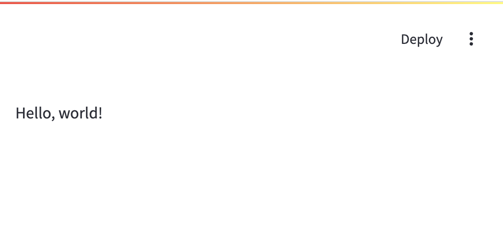
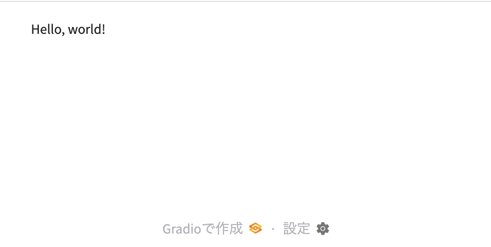

■タイトル
## 特集
# 人気の二大Python Web UIフレームワークを使い分けよう
### Streamlit ＆ Gradio入門

| 項目  | 内容 |
|-|-|
| 掲載予定 | 日経ソフトウエア2025年5月発売号（7月号） |
| 分量 | 12～16ページ程度 |
| 原稿締め切り | 2025年3月中旬 |
<!--
## ■備考

- 文体は「ですます」調
- Pythonのインデントは「半角スペース2文字分」
- スクリーンショットを撮る際は、フォントを大きめで。ブラウザの表示を適度にズームする。また、ウインドウの四隅の丸の外側が白になるように（スクリーンショットを撮るアプリで設定する。あるいは真っ白なウインドウを背景にしてスクリーンショットを撮る）

## ■構成案
-->

### はじめに

最近、Python界隈では、美しいインタラクティブなWebアプリケーションを簡単に作成できる「Python Web UIフレームワーク」と呼ばれるフレームワークが人気を集めています。その中でも特に注目を集めているのは「Streamlit」と「Gradio」の二つです。

これらはいずれもHTMLやJavaScript、HTTPやCSSなどのフロントエンド技術をほとんど知らなくてもPythonのみで開発ができることが特徴です。これらによって、従来は大量のコードを書かなければ実現できなかったレベルのWebアプリケーションを短時間で開発できます。

ただし、それぞれのコンセプトや方向性は異なり、開発しようとするアプリケーションの特性に応じて、もしくは自分に向いているものがどちらかを理解して選ぶことが重要です。本稿では、両者の特徴と基本的な使い方を比較を交えながら解説していきます。

### Python Web UIフレームワークとは

そもそもPython Web UIフレームワークとは何でしょうか？ 有名な「Djajgo」や「Flask」、「FastAPI」などのWebフレームワークとは何が違うのでしょうか？ この説明から始めましょう。

一般に以下がPython Web UIフレームワークの特徴です。

- インタラクティブな処理やグラフ表示など、高度なUIを容易に実現できる。
- HTML/CSS/JavaScript/SPAなどのフロントエンド特有の開発技術は隠蔽されており、基本的にはこれらを意識せずにPythonコードだけでWebアプリを作成できる
- ブラウザとサーバ間の通信処理(HTTP)も隠蔽されていてほとんど意識しないでよい。たとえばPOSTやGETなどのHTTPリクエストの存在を意識する必要はない。
- データベースアクセスなどのバックエンド機能などは機能範囲には含まれずUI開発のみを対象とする。

上記により、見た目も良く操作しやすいWebアプリケーション開発を比較的短期間で行うことができます。反面、自由度は限られ、表示速度・処理速度などは従来型のチューニングされたWebアプリケーションには基本的には劣ることも多いでしょう。なので用途としては、データサイエンスや生成AIアプリ、ダッシュボードなど、比較的負荷が低い用途でのアプリの開発に向いていると言えます。

### StreamlitとGradioの比較

表1に主な特徴の比較表を示します。ただし、StreamlitとGradioはいずれも現在進行形で活発な開発が続けられているWeb UIフレームワークなので、一方にのみある機能が後になって他方に実装されることも良くあります。従って以下はあくまで2025年5月時点の比較であることにご注意ください。また参考として、Pythonの簡易Webアプリフレームワークとして代表的なFlaskの情報を示しました。

[表1● StreamlitとGradio、およびFlaskの比較]

|項目|Streamlit|Gradio|Flask|
|-|-|-|-|
|開発言語|Python|Python|Python/CSS/HTML/JavaScript|
|典型的な用途|柔軟で対話的なダッシュボード|機械学習モデルのデモ|任意のWebアプリ|
|UI構築のコンセプト|UIコンポーネントを呼び出す|UIコンポーネントを配線する|HTMLそのもの|
|作成したアプリのシェア|ホスティングあり。|ホスティングあり。トンネリングでローカル実行しているアプリを全世界に公開|
|整備された画面部品のライブラリ|多数|多数|なし|
|学習コスト|低い。Pythonコードのみ|低い。Pythonコードのみ|高い。Pythonに加えHTML/JS/CSS/HTTPなどフロントエンド技術知識が必要|
|スケーラビリティ|低|低|高|


両者には似たとこもあるのですが、重要な違いをいくつか示しておきます。

#### Streamlitは入力や出力実行の過程がそのまま画面配置を決める

コンソールで実行するPythonのコマンドラインプログラムとして以下を考えてみてください。

[リスト1●inputoutput.py。コンソールで入出力を行うPythonプログラム]

```python
# コンソール版
a = int(input("A="))
b = int(input("B="))
if b != 0:
  print("A/B = ", a / b)
else:
  print("error")
```

このコードは「`python3 inputoutput.py`」で実行できます。このコードは、前段のinputでデータを入力し、そのデータを後段の処理の入力しています。つまり実行の過程が処理順序に対応しています。以下のように実行できます。


streamlitではこれを以下のように記述します。

[リスト1●st_inputoutput.py。Streamlitで入出力を行うWebアプリケーション]

```python
# streamlit版
import streamlit as st

a = st.number_input("A")
b = st.number_input("B")
if b != 0:
  st.write("A/B = ", a / b)
else:
  st.write("error")
```

コンソール版にほぼ対応していることがわかります。これを`streamlit run st_inputoutput.py`として実行し、ブラウザでlocalhostの8085ポートを開くことで以下のようにWebアプリケーションとして実行することができます。


ここでの`st.number_input`や`st.write`などはStreamlitが用意しているUIコンポーネントですが、これらをこの順番で呼び出すことで、画面に配置されてUIが構築されます。と同時に、これは処理の順番でもあるのです。

このように、画面構築の処理と、構築されたUIに基づいたプログラムの実行処理の順序が表裏一体になっていることがStreamlitの大きな特徴です。

この特徴により、Google ColaboratoryやJupyter Labs/Notebookなどで作成したコードをstreamlitのアプリに変換するのは容易です。なぜなら、Google Collabなどでも前段のセルの結果をもとにして次の計算を行うため、そのように過程を書き下していけば良いからです。

Streamlitの記述は処理が進むにつれて結果が次々と追加表示されていく処理と相性がよいのです。

#### GradioでのUI構築は配線である

GradioでのUIコードには大きくわけて2つの方法がある。高レベルと低レベル。

Gradioの低レベルな記述では、イベントハンドラを画面部品に設定していく伝統的なGUIライブラリと同様だが、それを大きくまとめる高水準コンポーネントがあり、「配線」のメタファーでコードを簡易に保つ(ここは実は説明図が必要)

GradioのBlockはwith句を用いたビルダーパターンであるが、これも比較的伝統的なものである。

### Streamlit入門

ではここから、実際にStreamlitを使って簡単なWebアプリケーションを作成していきましょう。まずは、Streamlitのインストール方法から始めます。

#### Streamlitのインストール

Streamlitのインストール方法は以下の通りです。

```bash
pip install streamlit
```

#### 「Hello, world!」と表示するプログラム

次に、Streamlitで「Hello, world!」を表示するプログラムを作成します。

[リスト1●hello_streamlit.py。Streamlitで「Hello, world!」を表示するプログラム]

```python
# st_hello.py
import streamlit as st

st.write("こんにちは世界!")
```

このコードを実行し、Webブラウザで開くと以下のようにWebアプリとして実行することができます。

[図1●リスト1の実行結果]



プログラムを実行したままPythonコードを書き換えることでいわゆるホットリローディングを行うことができますが、これを確認するためにst_hello.pyを以下のように書き換えてみます。st.markdownは引数の文字列をMarkdownフォーマットと解釈して画面に表示するStreamlitのUIコンポーネントの一つです。

```python
# st_hello2.py
import streamlit as st

st.write("こんにちは世界!")
st.markdown("""
|食品|価格|
|-|-|
|トマト|100円|
|たまねぎ|200円|
""")
```
書き換えたPythonコード保存した瞬間に画面は以下のようになります。


ここで、Rerunをクリックすると「今回だけ再実行」、Always rerunをクリックすると「今後コードを変更したときには毎回自動的に再実行」が行なわれます。いずれかをクリックすると変更されたコードが読み込まれ再実行され、画面は以下のように更新されます。


#### BMI計算機のプログラム

次に、StreamlitでBMI計算機のプログラムを作成します。

[リスト2●「st_bmi1」。Streamlitで作ったBMI計算機のプログラム]

```python
# st_bmi1.py
import streamlit as st

def bmi(height, weight):
  return weight / (height / 100) ** 2

if height := st.number_input("身長(cm)"): # ①
  if weight := st.number_input("体重(kg)"): # ②
    if height > 0 and weight > 0:
      bmi_value = bmi(height, weight)
      st.markdown(f"BMI = {bmi_value:.2f}")
    else:
      st.markdown("身長と体重を入力してください")

```

こちらでは、身長を入力する(図1)と体重の入力欄が表示され(図2)、体重を入力すると結果が出力されます(図3)。このように入力を行いながらの逐次主力・入力処理をl簡単に書けることがStreamlitの特徴の一つです。

図2●リスト2の実行例3


#### 二次関数を描画するプログラム

ここではグラフ表示のためにPythonの描画matplotlibを使用するようにします。l

```
pip install matplotlib
```

リスト3●「qf_streamlit.py」。Streamlitで作った2次関数のグラフを描画するプログラム

```python
# st_graph.py

import streamlit as st
import numpy as np
import matplotlib.pyplot as plt

st.title("2次関数のグラフ描画")

col1, col2 = st.columns(2)
with col1:
  a = st.number_input("係数 a", value=1.0)
  b = st.number_input("係数 b", value=0.0)
  c = st.number_input("係数 c", value=0.0)
with col2:
  x = np.linspace(-10, 10, 400)
  y = a * x**2 + b * x + c

  fig, ax = plt.subplots()
  ax.plot(x, y, label=f'y = a x^2 + bx + c\na={a}, b={b}, c={c}')
  ax.axhline(0, color='black', linewidth=0.5)
  ax.axvline(0, color='black', linewidth=0.5)
  ax.grid(color='gray', linestyle='--', linewidth=0.5)
  ax.legend()

  st.pyplot(fig)
```

[図3●リスト3の実行例]


<font color="blue">
(カラム)

Streamlitにおけるリアクティブな画面更新

Streamlitは画面が最更新される。一見効率がわるいが、Reactで実装されており描画がモサモサすることはない。またキャッシュや状態の使用が重要である。

</font>

### Gradio入門
※できればStreamlitと比較しながら書く
#### Gradioのインストール

```bash
pip install streamlit
```

#### Gradioで 「Hello, world!」と表示するプログラム
リスト4●「hello_gradio.py」。Gradioで「Hello, world!」を表示するプログラム
```python
import gradio as gr

with gr.Blocks() as demo:
    gr.Markdown("こんにちは世界!")

demo.launch()
```

図4●リスト4の実行結果

>

#### BMI計算機のプログラム
リスト5●「bmi_gradio.py」。Gradioで作ったBMI計算機のプログラム
```python
import gradio as gr

def bmi(height, weight):
  return weight / (height / 100) ** 2

demo = gr.Interface(
  fn=bmi,
  inputs=[
    gr.Number(label="身長 (cm)"),
    gr.Number(label="体重 (kg)")
  ],
  outputs=gr.Number(label="BMI")
)

demo.launch()
```

[図5●リスト5の実行例]


#### Gradioで二次関数のグラフを描画するプログラム

[リスト6●「qf_gradio.py」。Gradioで作った2次関数のグラフを描画するプログラム]

```python
import gradio as gr
import matplotlib
import numpy as np
import matplotlib.pyplot as plt

matplotlib.use('Agg')

def quadratic_plot(a, b, c):
  x = np.linspace(-10, 10, 400)
  y = a * x**2 + b * x + c

  # グラフ描画
  fig, ax = plt.subplots()
  ax.plot(x, y, label=f'y = {a} x^2 + {b}x + {c}')
  ax.axhline(0, color='black', linewidth=0.5)
  ax.axvline(0, color='black', linewidth=0.5)
  ax.set_xlabel("x")
  ax.set_ylabel("y")
  ax.grid(True)
  ax.legend()
  return fig

# 初期状態のグラフを生成
initial_plot = quadratic_plot(1, 0, 0)

# Gradioインターフェースの定義
demo = gr.Interface(
  fn=quadratic_plot,
  inputs=[
    gr.Slider(minimum=-10, maximum=10, step=0.1, value=1, label="係数 a"),
    gr.Slider(minimum=-10, maximum=10, step=0.1, value=0, label="係数 b"),
    gr.Slider(minimum=-10, maximum=10, step=0.1, value=0, label="係数 c")
  ],
  outputs=gr.Plot(value=initial_plot),
  live=True,
  title="二次関数グラフ表示アプリ",
  description="下のスライダーで係数a,b,cを調整するとy=ax^2+b+cのグラフが自動更新されます。"
)

demo.launch()

```

[図6●リスト6の実行例]


### チャットAIを作ってみよう
（※弊社では今のところ、「AIチャット」ではなく「チャットAI」と表記している）

OllamaとLLM（※gemma2あたりがおすすめ）を導入（※この部分の説明は簡潔に。多少、略していてもOK）
#### StreamlitでチャットAIを作る

```bash
pip install openai python-dotenv
```
[リスト7●「.env」設定ファイル]

```.env
OPENAI_API_KEY=dummy
OPENAI_BASE_URL=http://local:11434/v1
MODEL=gemma:7b
```

[リスト7●「chatai_streamlit.py」。Streamlitで作ったチャットAIのプログラム]
```python
import streamlit as st
from openai import OpenAI
from dotenv import load_dotenv
import os

load_dotenv()

client = OpenAI(
    base_url=os.getenv("BASE_URL"),
    api_key=os.getenv("OPENAI_API_KEY")
)

system_prompt = {"role": "system",
                 "content": "あなたは親切なAIチャットボットです。\
                 日本語で回答してください。"}

if "message_history" not in st.session_state:
  st.session_state.message_history = [system_prompt]

def chat_completion_stream(messages):
  response = client.chat.completions.create(
      model=os.getenv("MODEL"),
      messages=messages,
      stream=True,
  )
  return response

st.title("チャットAI(Streamlit)")

if user_input := st.chat_input("聞きたいことを入力してね！"):
  # 入力文字列をヒストリに追加
  st.session_state.message_history.append(
      {"role": "user", "content": user_input})
  for message in st.session_state.message_history:
    if message["role"] != "system":
      with st.chat_message(message["role"]):
        st.markdown(message["content"])

  with st.chat_message('ai'):
    # AIの応答を取得
    answer = st.write_stream(chat_completion_stream(
        st.session_state.message_history))
  # 回答文字列をヒストリに追加
  st.session_state.message_history.append(
      {"role": "assistant", "content": answer})
```

図7●リスト7の実行例


#### GradioでチャットAIを作る
リスト8●「chatai_gradio.py」。Gradioで作ったチャットAIのプログラム

```python
import time
import gradio as gr
from openai import OpenAI
from dotenv import load_dotenv
import os
from typing import Generator, Any, List, Dict

# OpenAI APIキーを環境変数に設定
load_dotenv()

client = OpenAI()

system_prompt = {"role": "system",
                 "content": "あなたは親切なAIチャットボットです。日本語で回答してください。"}

def chat_completion_stream(messages: List[Dict[str, str]]) -> Generator:
  response = client.chat.completions.create(
    model=os.getenv("MODEL"),
    messages=messages,
    stream=True,
  )
  return response

def chat_response(message: str, history: List[Dict[str, str]]) -> Generator:
  user_message = {"role": "user", "content": message}
  response = chat_completion_stream(
    [
      system_prompt,
      *history,
      user_message
    ])
  ai_message = ""
  for item in response:
    chunk = item.choices[0].delta.content
    if chunk is not None:
      ai_message += chunk
    yield ai_message

gr.ChatInterface(fn=chat_response, type="messages",
                 title="チャットAI(streaming)").launch(share=True)

```

図8●リスト8の実行例

```

```


<font color="blue">(カラム)
マルチページアプリの開発方法、StreamlitとGradioそれぞれで
ページ見合い
</font>

#### まとめ
