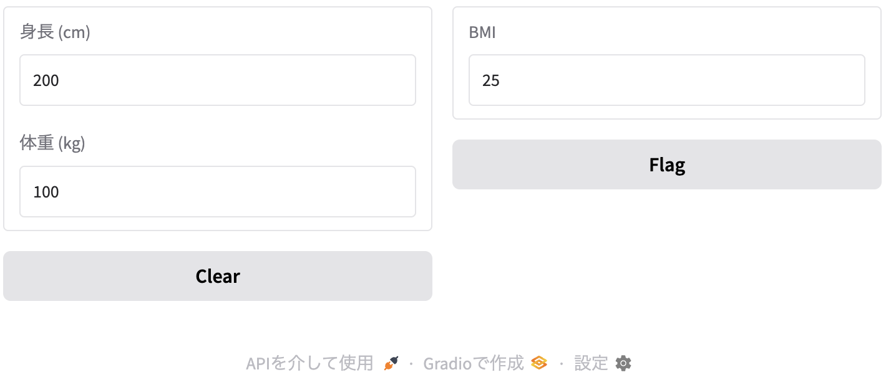
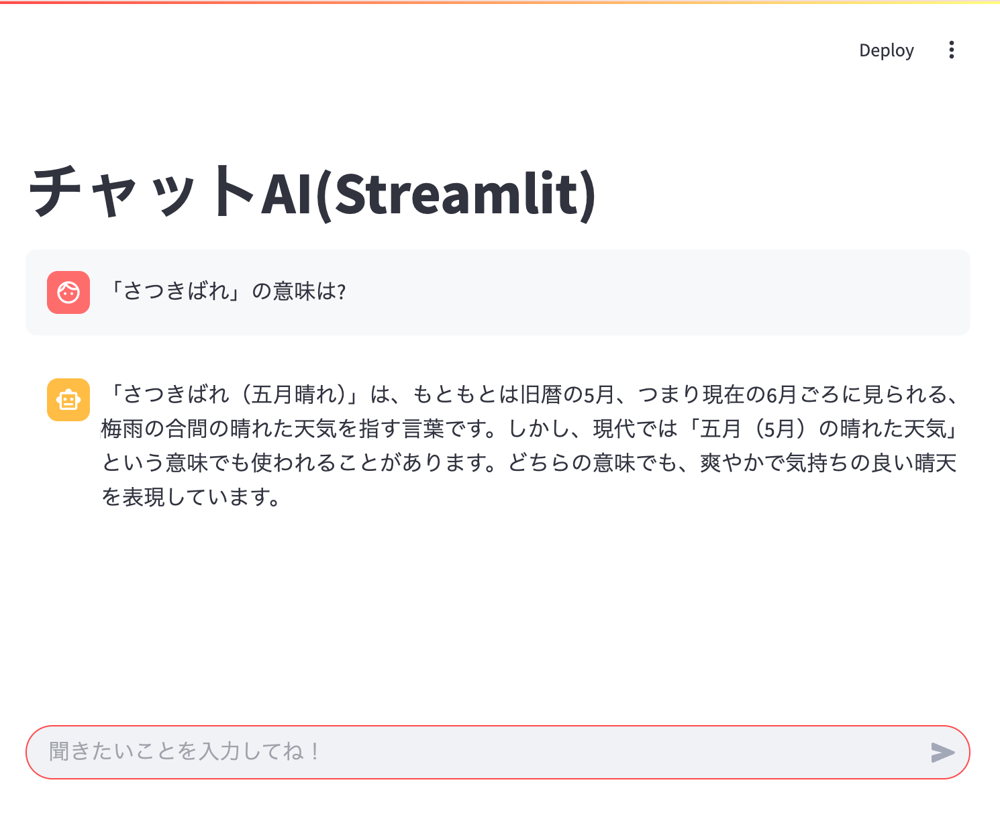

# 人気の二大Python Web UIフレームワークを使い分けよう
## Streamlit ＆ Gradio入門

NTTテクノクロス上原潤二

### はじめに

最近、Python界隈では、美しくインタラクティブなWebアプリケーションを簡単に作成できる「Python Web UIフレームワーク」が人気を集めています。
その中でも特に注目されているのが、「Streamlit（ストリームリット）」と「Gradio（グレディオ）」の二つです。

これらは、HTMLやJavaScript、CSSといったWebフロントエンド技術を直接使用しなくてもPythonだけで開発でき、
また処理の本質部分を記述するだけでWebアプリケーションを実装できます。この特徴により、従来よりも短時間で、見通しの良いコードを開発することができます。

ただし、それぞれのコンセプトや方向性は異なるため、開発しようとするするアプリケーションの特性を踏まえて、適したフレームワークを理解して選ぶことが重要です。本稿では、両者の特徴と基本的な使い方を比較しながら解説していきます。

### Python Web UIフレームワークとは

Python Web UIフレームワークとは何でしょうか？有名なDjangoやFlask、FastAPIなどのWebフレームワークとは何が違うのでしょうか？まずは、その違いを説明します。
一般に、Python Web UIフレームワークには以下のような特徴があります。

 - インタラクティブな処理やグラフ表示などのための豊富なUI部品が標準的に準備されており、高度なUIを少ない記述で容易に実現できる。
 - HTML、CSS、JavaScript、SPAなどのWebフロントエンド技術が隠蔽されており、基本的にPythonコードだけでWebアプリを作成できる。
 - ブラウザとサーバー間の通信処理（HTTP）も隠蔽されており、たとえばPOSTやGETなどのHTTPリクエストを意識する必要がない。
 - データベースアクセスなどのバックエンド機能は含まれず、UI開発のみに特化している。

以上により、見た目が良く、操作しやすいWebアプリケーションを比較的短期間で開発できます。一方で、画面作成上の自由度や表現力は限られ、表示速度や反応速度は、従来のチューニングされたWebアプリケーションに比べて劣ることが多いでしょう。

そのため、Python Web UIフレームワークを使用した開発は、不特定多数が利用するアプリではなく、インハウスでの利用、たとえばツール開発、ダッシュボード、データサイエンスや生成AIアプリなど比較的負荷が低い用途のアプリ開発に適しています。またPoCやMVPの開発などにも向いていると言えるでしょう。

### StreamlitとGradioとFlaskの比較

表1に主な特徴の比較表を示します。また参考として、Pythonの簡易Webアプリフレームワークとして代表的なFlaskの情報を示しました。

[表1● StreamlitとGradio、およびFlaskの比較]

| 項目 | Streamlit | Gradio | Flask |
|------|----------|--------|-------|
| **開発言語** | Python | Python | Python/HTML/CSS/JS |
| **典型的な用途** | インタラクティブなダッシュボード | 機械学習モデルのデモ | 任意のWebアプリ |
| **UI構築の概念** | 画面構築とイベントハンドラの融合 | 関数を対話的なアプリに変えるラッパー | Flask単体ではUIを提供しない |
| **組み込みUIコンポーネント** | 多数の標準UIあり | 多数の標準UIあり | なし（Flask単体ではUIを提供しない） |
| **学習コスト** | 低い（PythonのみでOK） | 低い（PythonのみでOK） | 高い（フロントエンド技術が必要） |
| **カスタマイズの自由度** | 低 | 低 | 高 |
| **スケーラビリティ** | 低（小規模向け） | 低（小規模向け） | 高（規模によらない） |

StreamlitとGradioの両者にはPython Web UIフレームワークとして重なるところも大きいのですが、重要な違いをいくつか示しておきます。

#### Streamlitは入力や出力指示の実行の過程が画面配置を決める

コンソールで実行するPythonのコマンドラインプログラムとして以下を考えてみてください。

[リスト1●cli_inputoutput.py。コンソールで入出力を行うPythonプログラム]

```python
# cli_inputoutput.py
a = int(input("A=")) # ①
b = int(input("B=")) # ②
if b != 0:
  print("A/B = ", a / b)  # ③
else:
  print("error")
```

このコードは「`python3 divide_console.py`」で実行できます。このコードは①②での入力の結果を得て、③の処理でそれを出力するような実行の過程を記述しています。StreamlitではWebアプリをこのような処理を以下のように記述できます。

[リスト1●st_inputoutput.py。Streamlitで入出力を行うWebアプリケーション]

```python
# st_inputoutput.py
import streamlit as st

a = st.number_input("A") # ①
b = st.number_input("B") # ②
if b != 0:
  st.write("A/B = ", a / b)
else:
  st.write("error")
```

コンソール版のものと記述の流れほぼと対応していることがわかります。

<div style="border: 1px solid #ccc; border-radius: 1rem; padding: 1rem; width: 90%">
  <ul style="list-style: none; padding: 0; margin: 0;">
    <li style="margin-bottom: 5px; padding-left: 1.5em; text-indent: -1.5em;"><span style="margin-right: 5px;">⚠</span>
    ただし、コンソール版とStreamlit版の実行時の動作の違いとしては、
    コンソール版のinput()は利用者が文字列を入力しエンターキーが押されるまでブロックするのに対して、StreamlitのUIコンポーネント(ここでは「st.number_input()」)は呼び出したときにブロックしません。
    つまりリスト1の①でaの値が入力されるまで待つわけではないので、
    ②のbの入力欄は最初から表示されます。
    このことはStreamlitプログラミングを理解するための一つのポイントとなります。
    </li>
  </ul>
</div>

これを`streamlit run st_inputoutput.py`として実行し、ブラウザでlocalhostの8085ポートを開くことで以下のようにWebアプリケーションとして実行することができます。


このように、画面にUIコンポーネントを配置するための記述と、構築されたUIに基づいたプログラムの実行処理の記述が表裏一体になっていることがStreamlitの大きな特徴です。
このことは後述します。

#### Gradioは関数を対話的なアプリに変えるラッパー

Gradioはもともと機械学習モデルのインタラクティブなデモの作成を目的として開発されていて、
機械学習モデルを共有・公開するサイトHugging Faceで活用されています。
ただし、Gradioの機能は機械学習モデルのデモだけに留まらない豊富で汎用的な機能を備えており、
本稿でも汎用的なPython Webフレームワークとして見たときの機能やプログラミングについて解説します。

それを前提として、Gradioを一言で説明するならば、「関数を対話的なアプリに変えるラッパー」だと考えることができます。
たとえば、以下はGradioのコード例ですが(ここでは詳細を理解する必要はありません)、
gr.Interface()というUIコンポーネントは、invert_colorsというロジックだけを含む関数をラッピングします。

```python
# invert_colors.py
import gradio as gr
import numpy as np

# 色を反転させる関数
def invert_colors(img: np.ndarray) -> np.ndarray:
    return 255 - img

demo = gr.Interface(fn=invert_colors, # ラッピングしたい関数fn
                    inputs="image", # fnの引数に対するUIコンポーネントの指定(gr.Image())
                    outputs="image") # fnの返り値に対するUIコンポーネントの指定(gr.Image())
demo.launch()
```

gr.Interface()に、UIを表示させたい関数をfn、「fnの入出力に対して
どんなユーザインターフェースを与えるか」をそれぞれinputsとoutputsとして与えると、
イメージをアップロードして反転処理をすることができる、
見栄えのよいUIが作りだされてます。


### Streamlit入門

ではここからはそれぞれのフレームワークの利用方法とプログラミングについてそれぞれ簡単に一巡りしていきたいと思います。まずはStreamlitからです。

#### Streamlitのインストール

Pythonがインストールされていることを前提として、Streamlitのインストール方法は以下の通りです。

```bash
> mkdir streamlit-sample
> cd streamlit-sample
> python3 -m venv venv
> source ./venv/bin/activate
> pip install streamlit
```

#### Streamlitで「Hello, world!」と表示するプログラム

次に、Streamlitで「Hello, world!」を表示するプログラムを作成します。

[リスト1●st_hello.py。Streamlitで「Hello, world!」を表示するプログラム]

```python
# st_hello.py
import streamlit as st # ①

st.write("Hello, world!")
```

まず、①ではStreamlitライブラリをインポートし、stという短縮名で利用できるようにします。次に、②ではWebブラウザに文字列を表示するためにwriteコンポーネントを呼び出します。このコードを作成し保存し、以下のコマンドでWebアプリを起動できます。

```bash
> streamlit run st_hello.py
```

起動後にWebブラウザでlocalhostのポート番号8501を開くと、作成したWebアプリを実行できます。

[図4●リスト1の実行結果]


ここで、プログラムを実行したままバックグラウンドでPythonコードを変更することで、再起動無しでプログラムを置き換えることができる、いわゆるホットリローディングを行うことができます。たとえばst_hello.pyの「st.write("Hello world!")」を「st.write("こんにちは世界")」にエディタで書き換えて保存すると、ブラウザの画面上部に以下が表示されます。

[図4●リスト1の再実行時の画面上部]


ここで「Rerun」をクリックすると一回だけの再実行ができます。「Always rerun」をクリックすると変更されるたびに再実行が行なわれるようになります。

[図4●リスト1の再実行結果]


★★★TODO: 画像を差し変える

#### StreamlitでのBMI計算機のプログラム

次の題材として、BMI(ボディ・マス指数、体重と身長の比率から計算される体格の指標)
を計算するプログラムをStreamlitで作成してみます。

[リスト2●「st_bmi1.py」。Streamlitで作ったBMI計算機のプログラム]

```python
# st_bmi1.py
import streamlit as st

def bmi(height, weight):  # ①
  return weight / (height / 100) ** 2  # ②

if height := st.number_input("身長(cm)"):  # ③
  if weight := st.number_input("体重(kg)"):  # ④
    if height > 0 and weight > 0:  # ⑤
      bmi_value = bmi(height, weight)  # ⑥
      st.markdown(f"BMI = {bmi_value:.2f}")  # ⑦
    else:
      st.markdown("身長と体重を入力してください")
```

プログラムを説明していきましょう。まず、①ではBMIを計算する関数を定義しています。これは通常のPythonの関数定義です。

③④では身長と体重の入力欄を表示し、入力された値をそれぞれheight、weightの変数に保存します。
「:=」は、Python 3.8で導入された演算子で、代入と同時にその値を返す演算子です。
この演算子を使わないで書くとしたら③のif文は、

```python
height = st.number_input("身長(cm)"):
if height:
  :
```

と書くのと同じです。入力が空(None)であればif文の本体は実行されず、
身長が入力されると体重の入力欄が表示され、体重の入力をすると結果が表示される、
という逐次動作を実現しています。(図4●リスト4の実行結果)

ここで仮にif文でネストさせずに、以下のようにフラットに入力欄を
並べて書くと,身長(heght)欄と体重(weight)の入力欄は同時に表示されます。

```python
height = st.number_input("身長(cm)"):
weight = st.number_input("体重(kg)"):
```

[図4●リスト4の実行結果]


このように、入力が進行するにつれその処理結果結果や次の入力欄が次々に下に追記されていくような処理を簡単に書けることがStreamlitの特徴の一つです。このような動作は、コンソールで動作するプログラムやGoogle Collabでの実行とイメージが似ています。

⑤では、入力された身長と体重が0より大きいことをチェックしています。0以下である場合はエラーメッセージを表示し、そうでなければ関数bmiを呼び出してBMIの値を整形して表示します(⑥⑦)。

<div style="border: 1px solid #ccc; border-radius: 1rem; padding: 1rem; width: 90%">
##### カラム: if文のネストを避ける方法

if文のネストを使うことで、処理結果を次々と表示してくような処理がStreamlitでは書きやすいことを示しました。しかし処理が何段階にも連なっていくとif文のネストが深くなってしまいます。
これを避けるには、リスト4のようにプログラムのトップレベルを関数にして、継続しないときにifの条件を反転させてreturnするように記述すると良いでしょう。

[リスト4●処理の段階が増えてもネストが深くならない記述方法]
```python
def main():
  if not (height := st.number_input("身長(cm)")):
    return
  if not (weight := st.number_input("体重(kg)")):
    return
  if height > 0 and weight > 0:
    bmi_value = bmi(height, weight)
    st.markdown(f"BMI = {bmi_value:.2f}")
  else:
    st.markdown("身長と体重を入力してください")

main()
```
</div>

#### Streamlitで二次関数を描画するプログラム

次に紹介するのは、ユーザーが入力する係数 a, b, c に基づいて、2次関数「y= a^2 + bx + c」のグラフを描画するプログラムです。

まず、準備として、グラフ表示のためにPythonの描画matplotlibをパッケージとしてインストールしておきます。

```bash
❯ pip install matplotlib
```

プログラムコードはリスト3の通りです。

[リスト3●「st_graph.py」。Streamlitで作った2次関数のグラフを描画するプログラム]

```python
# st_graph.py

import streamlit as st
import numpy as np               # ①
import matplotlib.pyplot as plt  # ②

st.title("2次関数のグラフ描画")

col1, col2 = st.columns(2)       # ③
with col1:                       # ④
  a = st.number_input("係数 a", value=1.0)  # ⑤
  b = st.number_input("係数 b", value=0.0)  # ⑥
  c = st.number_input("係数 c", value=0.0)  # ⑦
with col2:                       # ⑧
  x = np.linspace(-10, 10, 400)   # ⑨
  y = a * x**2 + b * x + c        # ⑩

  fig, ax = plt.subplots()        # ⑪
  ax.plot(x, y, label=f'y = a x^2 + bx + c\na={a}, b={b}, c={c}')
  ax.axhline(0, color='black', linewidth=0.5)
  ax.axvline(0, color='black', linewidth=0.5)
  ax.grid(color='gray', linestyle='--', linewidth=0.5)
  ax.legend()

  st.pyplot(fig)                 # ⑫
```

このプログラムの実行の様子を図3に示します。左側に係数入力フォームが表示され、入力された
係数に応じて右側に2次関数のグラフが表示されます。

[図3●リスト3の実行例]


このプログラムを説明していきます。

①②では、グラフの描画に必要なNumPyとMatplotlibの必要なモジュールをインポートします。

次にプログラムのタイトルとして「2次関数のグラフ描画」を表示します。
③④⑧では「st.columns(2)」をつかって画面を左右の2つのカラムに分割します。
col1には左側、col2には左側のカラムをわりあて、with句をつかってそれぞれのブロックの内側に部品を配置していきます。

⑤⑥⑦では左側のカラムに係数a,b,cの入力欄を配置します。入力結果は変数a,b,cに格納されます。

⑨からは右側のカラムにグラフ表示コンポーネントを配置します。まず、⑨ではx軸の系列の値として、-10から10までの範囲で400個の等間隔な数値を生成します。
⑫では、y軸の系列の値として、ユーザーが入力した係数を用いて、2次関数「ax+by+c」を計算します。

⑪以降、matplotlibを使用して、2次関数のグラフを描画し、軸やグリッドや凡例も追加したグラフを作成します。

⑲では、作成したグラフをStreamlit上に配置します。


<font color="blue">
(カラム)

Streamlitにおけるリアクティブな画面更新

Streamlitは画面が最更新される。一見効率がわるいが、Reactで実装されており描画がモサモサすることはない。またキャッシュや状態の使用が重要である。

</font>

### Gradio入門

ここからはGradioの入門編ということでGradioのインストール・実行方法、
プグラミングについて簡単に解説していきます。

#### Gradioのインストール

Pythonがインストールされていることを前提として、Gradioのインストール方法は以下の通りです。

```bash
> mkdir gradio-sample
> cd gradio-sample
> python3 -m venv venv
> source ./venv/bin/activate
> pip install gradio
```

#### Gradioで 「Hello, world!」と表示するプログラム

リスト4は、Gradioを用いて「Hello, world!」を表示するプログラムです。

[リスト4●「gr_hello.py」。Gradioで「Hello, world!」を表示するプログラム]

```python
# gr_hello.py
import gradio as gr # ①

with gr.Blocks() as demo:   # ②
  gr.Markdown("Hello, world!")   # ③

demo.launch() # ④
```
[図3●リスト3の実行例]


以下、解説していきます。

①ではGradioライブラリをインポートし、短縮名としてgrを割りあてています。

②ではレイアウトのためのコンポーネントであるgr.Blocks()を作成し、その内側にコンポーネントを配置する準備をしています。with句を使うとコンテキストが作成され、その内側でのgr.Markdownなどのコンポーネントの呼び出しはそのブロック内に配置されるようになります。作成したkonoブロックをas demoでasという変数に格納しています。

④では、demoに格納されたBocksコンポーネントに対してlaunch()メソッドを呼び出し、Webアプリケーションとして起動します。Streamlitではこのような起動をしなくてもWebアプリとして実行できたのですが、Gradioではlaunchの呼び出しが必要です。

#### GradioでのBMI計算機のプログラム

[リスト5●「gr_bmi.py」。Gradioで作ったBMI計算機のプログラム]

```python
# gr_bmi.py
import gradio as gr

def bmi(height, weight):  # ①
  return weight / (height / 100) ** 2

demo = gr.Interface(      # ②
  fn=bmi,                # ③
  inputs=[               # ④
    gr.Number(label="身長 (cm)"),  # ⑤
    gr.Number(label="体重 (kg)")   # ⑥
  ],
  outputs=gr.Number(label="BMI")  # ⑦
)

demo.launch()            # ⑧
```

プログラムを説明していきます。

①はBMIを計算する関数bmiの定義です。Streamlit版と全く同じものです。

②は関数の高レベルの汎用GUIラッパーであるgr.Interfaceを呼び出し、demoに保存します。
gr.Interfaceはラッピングする対象の関数fn(③)、
関数fnへの入力の型式や方法を規定するinputs(④)、
関数fnの返り値を規定するoutputs(⑦)などを引数として与えます。

⑤⑥は、fnの入力として、身長と体重の数値を入力するためのコンポーネントgr.Numberを与えます。

⑧では、demo.launch()によりGradioのgr.InterfaceコンポーネントをWebアプリとして起動します。デフォルトではローカルホストの特定ポート7860でWebサーバが起動し、ブラウザからアクセスできるようになります。


[図3●リスト3の実行例]


#### Gradioで二次関数のグラフを描画するプログラム

[リスト6●「gr_graph.py」。Gradioで作った2次関数のグラフを描画するプログラム]

```python
## gr_graph.py
import gradio as gr
import matplotlib
import numpy as np
import matplotlib.pyplot as plt

matplotlib.use('Agg')                 # ①

def quadratic_plot(a, b, c):          # ②
  x = np.linspace(-10, 10, 400)
  y = a * x**2 + b * x + c

  # グラフ描画
  fig, ax = plt.subplots()
  ax.plot(x, y, label=f'y = {a} x^2 + {b}x + {c}')
  ax.axhline(0, color='black', linewidth=0.5)
  ax.axvline(0, color='black', linewidth=0.5)
  ax.set_xlabel("x")
  ax.set_ylabel("y")
  ax.grid(True)
  ax.legend()
  return fig

# 初期状態のグラフを生成
initial_plot = quadratic_plot(1, 0, 0)  # ③

# Gradioインターフェースの定義
demo = gr.Interface(                  # ④
  fn=quadratic_plot,
  inputs=[                            # ⑤
    gr.Slider(minimum=-10, maximum=10, step=0.1, value=1, label="係数 a"),
    gr.Slider(minimum=-10, maximum=10, step=0.1, value=0, label="係数 b"),
    gr.Slider(minimum=-10, maximum=10, step=0.1, value=0, label="係数 c")
  ],
  outputs=gr.Plot(value=initial_plot), # ⑥
  live=True,                          # ⑦
  title="二次関数グラフ表示アプリ",
  description="下のスライダーで係数a,b,cを調整するとy=ax^2+b+cのグラフが自動更新されます。"
)

demo.launch()
```

プログラムを説明していきます。

①は、初期表示のタイミングの問題でエラーにならないようにするための設定です。matplotlibの描画バックエンドとしてAggを使用するものです。

②はStreamlit版の「st_graph.py」の⑨以降の処理とほぼ同じなので説明は割愛します。

③初期値としてa=1,b=0,c=0を渡し、最初に表示するグラフ（初期プロット）を生成します。

④でGradioのgr.Interfaceを呼び出します。⑤のinputsはBMDと同様ですが、outputsでは
matplotlibのplotを受けとって表示できるグラフ描画のコンポーネントgr.Plotl()を設定します(⑥)。


[図3●リスト3の実行例]


### チャットAIを作ってみよう

さて、ここまでは基本的なUIコンポーネントを使用した幾つかのサンプルアプリケーションを作ってきました。最後に、それぞれで生成AIを呼びだして会話を行う、チャットAIアプリケーションをそれぞれで作ってみます。

接続先としてはollamaのOpenAI互換のAPIを経由して、ローカルLLMを呼び出すようにしてみます。

まず、StreamlitとGradioに共通する準備を行います。

#### 準備1：ollamaのインストールと動作確認

Windos, Macによって異なりますが、公式サイト(https://ollama.com/)からダウンロードしてインストールします。説明も参考にしてインストールしてみてください。Macの場合はHomebrewでもインストールできます。

ollamaでLLMモデルを以下のようにダウンロードして(①)、APIサーバを起動します(①)。以下ではgemma2を利用しています。

```bash
❯ ollama pull gemma2  # ①
❯ ollama serve    # ②
❯ curl http://localhost:11434/v1/models
```

#### 準備2：dotenvによる環境変数の設定

```
OPENAI_API_KEY=dummy
OPENAI_BASE_URL=http://localhost:11434/
MODEL=gemma:7b
```
#### 準備3：生成AIを呼び出す共通モジュール定義

```python
# chatai_util.py
from typing import Generator, List, Dict  # ①
from openai import OpenAI  # ②
from dotenv import load_dotenv  # ③
import os

load_dotenv()  # ④

client = OpenAI(
  base_url=os.getenv("BASE_URL"),       # ⑤
  api_key=os.getenv("OPENAI_API_KEY")   # ⑥
)

SYSTEM_PROMPT = {"role": "system",
                 "content": "あなたは親切なAIチャットボットです。\
                 日本語で回答してください。"}  # ⑦

def chat_completion_stream(messages: List[Dict[str, str]]) -> Generator:
  response = client.chat.completions.create(
    model=os.getenv("MODEL"),  # ⑧
    messages=messages,
    stream=True,               # ⑨
  )
  return response               # ⑩
```

解説

①ここからの説明で使用するために、Pythonの型ヒント用の型をいくつかインポートしておきます。

②では、OpenAIが提供する生成AIのAPIを呼び出すためのライブラリ内のOpenAIクラスをインポートしています。
ollamaやGeminiやClaudeなどのAPIはOpenAI互換のAPIを備えているものが多いので、これを経由してAPIを呼び出す
ことで、切り替えが容易なプログラムとすることができます。

③④.envファイルを読み込み、環境変数としてセットしてくれるdotenvライブラリをインポートしています。
.envは、一般にシークレット情報をソースコードとしてハードコーディングを避けるために使用するものです。
このサンプルコードでは、接続先LLMを設定ファイル中の設定として切りかえることで異なる生成APIを
切り替えて使用する目的でも使用します。

⑤⑥base_url, api_keyを環境変数から設定します。

⑦LLMに与える「システムプロンプト」をOpenAIのAPIに送るメッセージの型式で定義しています。具体的にはメッセージの話者を表わすroleキーと、メッセージ本体をあらすcontentのキーをもった辞書の型式です。一般にOpenAI互換のAPIではroleとして以下を使用します。

|role|説明|
|-|-|
|sytem|システムプロンプト|
|user|ユーザからのメッセージ|
|ai|AIアシスタントからの回答|

⑨ chat_completion_stream()はメッセージをあらわす辞書のリスト（messages）を受け取り、ストリーミング応答をジェネレータとして返す関数です。

⑩ 使用する生成AIのモデルを環境変数"MODEL"から取得します。

⑪ messages=messages
　チャットAPIに送るメッセージ履歴をそのまま渡しています。メッセージは通常、以下のような形式で構成されます。

⑫ ストリーミングモードを有効にしています。この変数がTrueか否かで返り値の型がジェネレータどうかが決定されます。

⑬ API呼び出しのジェネレータレスポンスをそのまま返します。

#### StreamlitでチャットAIを作る

```bash
❯ pip install openai python-dotenv
```
[リスト7●「.env」設定ファイル]

```bash
# .env
OPENAI_API_KEY=dummy
OPENAI_BASE_URL=http://local:11434/v1
MODEL=gemma:7b
```

[リスト7●「st_chatai.py」。Streamlitで作ったチャットAIのプログラム]

```python
# st_chatai.py
import streamlit as st
from chatai_util import chat_completion_stream, SYSTEM_PROMPT  # ①

if "message_history" not in st.session_state:  # ②
  st.session_state.message_history = [SYSTEM_PROMPT]

st.title("チャットAI(Streamlit)")

if user_input := st.chat_input("聞きたいことを入力してね！"):  # ③
  # 入力文字列をチャット履歴に追加
  st.session_state.message_history.append(  # ④
    {"role": "user", "content": user_input}
  )
  # チャット会話を表示する
  for message in st.session_state.message_history:  # ⑤
    if message["role"] != "system":
      with st.chat_message(message["role"]):  # ⑥
        st.markdown(message["content"])  # ⑦

  with st.chat_message('ai'):  # ⑧
    # AIの応答を逐次ストリーム取得
    answer = st.write_stream(chat_completion_stream(  # ⑨
      st.session_state.message_history
    ))
  # 回答文字列をチャット履歴に追加
  st.session_state.message_history.append(  # ⑩
    {"role": "assistant", "content": answer}
  )
```
[図3●リスト3の実行例]



①先ほど作成した生成AIアクセス用の共通モジュール「chatai_util.py」で定義した機能をインポートします。

②Streamlitのセッション状態を保持する変数st.session_stateに、チャット履歴の初期値を設定する。
「message_history」というキーがない場合、最初のアクセスまたは未定義状態と判断し、新たにメッセージ履歴（message_history）を
システムプロンプトを設定するように初期化しています。OpenAI互換のモデルでは、
LLMはシステムプロンプトを、roleが"system"であるメッセージの履歴として設定します。

③st.chat_input()はチャット入力欄を含む、チャット画面のためのStreamlitのUIコンポーネントです。
chat_input()は少し動作が特殊で、画面の下部にチャット入力欄が固定されるようなレイアウトになります。

④入力された文字列をroleが"user"のメッセージとして、チャット履歴（message_history）の末尾に追加します。

⑤現在までの対話履歴を、システムプロンプトを除いて表示していきます。

⑥⑦st.chat_messageをwith句を使って呼び出すと、メッセージ中のroleに対応するアイコンを表示した上で、
メッセージ中のcontentに対応するメッセージをst.writeなどで表示することができます。

⑨LLMからの応答メッセージを表示します。st.write_stream()はOpenAI互換のストリーム
が返すジェネレータに対応いているので、chat_completion_stream()の返り値をそのまま渡すことができます。

⑩AIからの応答メッセージをチャット履歴（message_history）の末尾に追加します。

#### GradioでチャットAIを作る
リスト8●「gr_chatai.py」。Gradioで作ったチャットAIのプログラム

```python
# gr_chatai.py
import gradio as gr
from typing import Generator, List, Dict
from chatai_util import chat_completion_stream, SYSTEM_PROMPT  # ①

# ②
def chat_response(message: str, history: List[Dict[str, str]]) -> Generator:
  # ユーザからのメッセージ
  user_message = {"role": "user", "content": message}  # ③
  # 生成AIのレスポンスはチャンク列のジェネレータ
  response = chat_completion_stream([
    SYSTEM_PROMPT,
    *history,
    user_message
  ])  # ④
  ai_message = ""  # ⑤
  # チャンク列のジェネレータに対してループをまわす
  for item in response:  # ⑥
    chunk = item.choices[0].delta.content
    if chunk is not None:
      # チャンクJSONのdelta部分を変数ai_messageに累積追加する
      ai_message += chunk # ⑦
  yield ai_message  # ⑧

demo = gr.ChatInterface(fn=chat_response, type="messages",
                        title="チャットAI(Gradio)")  # ⑨
demo.launch()
```

[図3●リスト3の実行例]


①先ほど作成した生成AIアクセス用の共通モジュール「chatai_util.py」で定義した機能をインポートします。

②関数「chat_response()」は、Gradioが用意しているチャットコンポーネントgr.ChatInterfaceにラッピングさせる関数です。
gr.ChatInterfaceはチャット履歴を管理する機能を持っているので、Streamlit版とは異なり、チャット履歴を管理するコードを書く必要がありません。

③では、LLMに送信するユーザメッセージ「user_message」を作成します。ここではロールとして"user"を設定します。

④SYSTEM_PROMPT、gr.ChatInterfaceから渡されたチャット履歴とユーザメッセージを、
生成AIアクセス用の共通モジュール「chatai_util.py」で定義したchat_completion_streamを使ってLLMに送信します。
ストリーミング形式(streaming=True)で応答を取得するので、結果はGeneratorとなります。

⑥AIからストリーミングで帰ってくるメッセージはチャンク化された断片なので、それを結合して保持するための変数を用意します。
⑦chat_completion_streamから取得した1チャンクずつを、ai_messageに蓄積していきます。
⑧で、1つの応答文字列が得られたら、それをyieldで返します。
つまりこの関数chat_response全体は、LLMが返却する応答断片(JSON型式)のジェネレータを、回答単位の文字列のジェネレータに変換していることになります。

⑨Gradioでの高レベルなチャットコンポーネントであるgr.ChatInterface()を準備します。fnにはジェネレータを返す関数chat_responseを与えることでStreamingに対応する表示(プログレッシブな回答の漸増的表示)を行うことができます。
ここでtype="messages"はチャットのメッセージ形式で表示するように指定しています。
タイトルも指定します。

## まとめ
